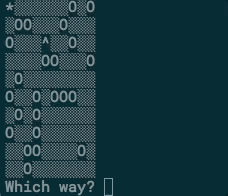

# Find Your Hat

## Overview

This project is slightly different than others you have encountered thus far on Codecademy. Instead of a step-by-step
tutorial, this project contains a series of open-ended requirements which describe the project you’ll be building.
There are many possible ways to correctly fulfill all of these requirements, and you should expect to use the
internet, Codecademy, and other resources when you encounter a problem that you cannot easily solve.

## Project Goals

In this project, you’ll be building an interactive terminal game. The scenario is that the player has lost their
hat in a field full of holes, and they must navigate back to it without falling down one of the holes or stepping
outside of the field.

## Prerequisites

In this project, you’ll be building an interactive terminal game with JavaScript classes. Because the goal involves
user input, make sure you read our guide on working with user input in Node.js:
https://www.codecademy.com/articles/getting-user-input-in-node-js .
If you complete this project on our platform, you can test and run your code with the command node main.js in our
terminal.

Watch this animated gif to get a sense of what you’ll be building:

